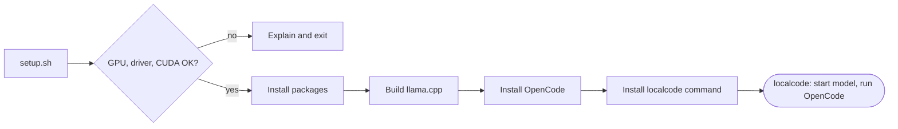

<div align="center">

<a href="https://opencode.ai">
  <picture>
    <source srcset="https://raw.githubusercontent.com/anomalyco/opencode/dev/packages/console/app/src/asset/logo-ornate-dark.svg" media="(prefers-color-scheme: dark)">
    <source srcset="https://raw.githubusercontent.com/anomalyco/opencode/dev/packages/console/app/src/asset/logo-ornate-light.svg" media="(prefers-color-scheme: light)">
    
  </picture>
</a>

# opencode - Quick Start

**OpenCode + llama.cpp on your own NVIDIA GPU, set up in one command.**


</div>

`localcode` checks your GPU, driver and CUDA first, and exits with a clear message if anything is missing.
Then it installs the support packages, builds llama.cpp with CUDA and installs OpenCode.
The `localcode` launcher starts the model server and, if VRAM is short, lists the apps using your GPU so you can close them.
Run it from any project folder and code with a private model: no cloud, no API bill.



## Requirements

- Ubuntu
- NVIDIA GPU with the NVIDIA driver and CUDA toolkit installed

`setup.sh` checks these first. If the GPU, driver or CUDA is missing or too old, it tells you and exits without installing anything.

## Install

```bash
git clone <this-repo> localcode && cd localcode
./setup.sh
```

It installs build packages, builds llama.cpp with CUDA, installs OpenCode, and puts `localcode` in `~/.local/bin`. Existing config files are never overwritten.

Options: `./setup.sh --check` (checks only), `./setup.sh --dry-run`.

## Configure

Setup creates two config files from examples. Edit both before first use.

### 1. Add a model to `~/models/models.ini`

1. Download a `.gguf` model, e.g. into `~/models/`:
   ```bash
   pip install --user -U "huggingface_hub[cli]"
   hf download <repo-id> <file>.gguf --local-dir ~/models
   ```
2. Open the file: `nano ~/models/models.ini`
3. Set the section name (this is the **model ID**) and the path to your file:
   ```ini
   # localcode-default: my-model

   [*]
   n-gpu-layers = 99
   flash-attn = on

   [my-model]
   model = /home/YOU/models/your-model.gguf
   ctx-size = 65536
   ```
   - `# localcode-default:` picks the model `localcode` loads by default.
   - Add one `[section]` per extra model.
   - Out of VRAM? Lower `ctx-size`.

### 2. Point OpenCode at it in `~/.config/opencode/opencode.jsonc`

1. Open the file: `nano ~/.config/opencode/opencode.jsonc`
2. Make the model ID match the section name from `models.ini`:
   ```jsonc
   {
     "provider": {
       "local": {
         "npm": "@ai-sdk/openai-compatible",
         "name": "llama.cpp (local)",
         "options": { "baseURL": "http://127.0.0.1:8081/v1" },
         "models": {
           "my-model": { "name": "My Model" }
         }
       }
     },
     "model": "local/my-model"
   }
   ```
   - Keep the port `8081` (the port `localcode` uses).
   - For several models, add one entry per `[section]` under `"models"`.
   - If your OpenCode version complains about the format, check its docs at [opencode.ai](https://opencode.ai); only the `baseURL` and model IDs matter here.

## Use

Open a new terminal, go to your project, and run:

```bash
localcode
```

Other options:

```bash
localcode --lc-model NAME   # use another model from models.ini
localcode --lc-pick         # always offer the close-apps picker before loading
```

Any other arguments are passed to `opencode`.

## Settings

| Variable | Default | Meaning |
|---|---|---|
| `LOCALCODE_MODEL` | marked in models.ini | model to load |
| `LOCALCODE_INI` | `~/models/models.ini` | presets file |
| `LOCALCODE_MIN_FREE_MIB` | `12000` | free VRAM needed to skip the close-apps prompt |
| `NO_COLOR` | unset | disable colours |

## Files

| Path | Purpose |
|---|---|
| `~/.local/bin/localcode` | the launcher |
| `~/llama.cpp` | llama.cpp build |
| `~/models/models.ini` | model presets |
| `~/.config/opencode/opencode.jsonc` | OpenCode config |
| `~/llama-server.log` | server log |


OpenCode and its logo belong to the [OpenCode](https://opencode.ai) project. This repo is an independent setup helper.
